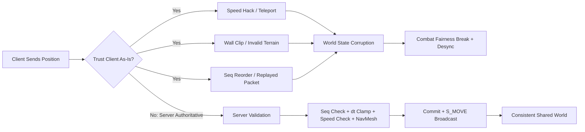
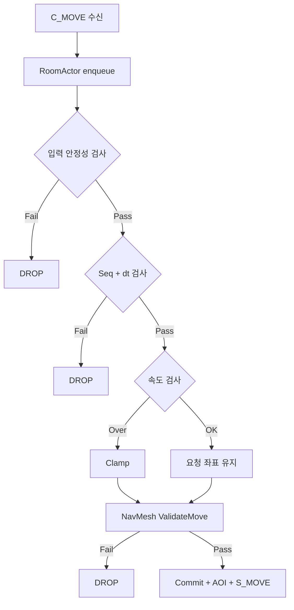
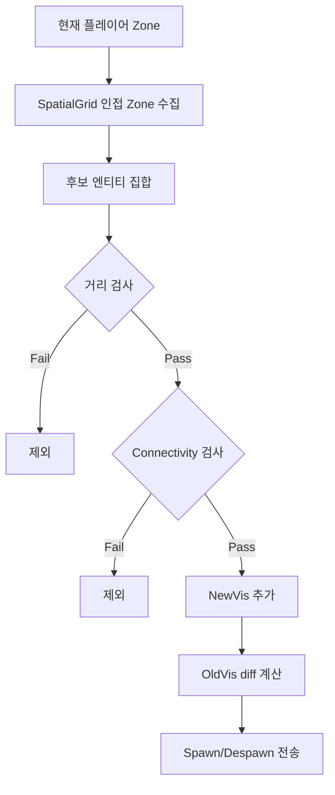
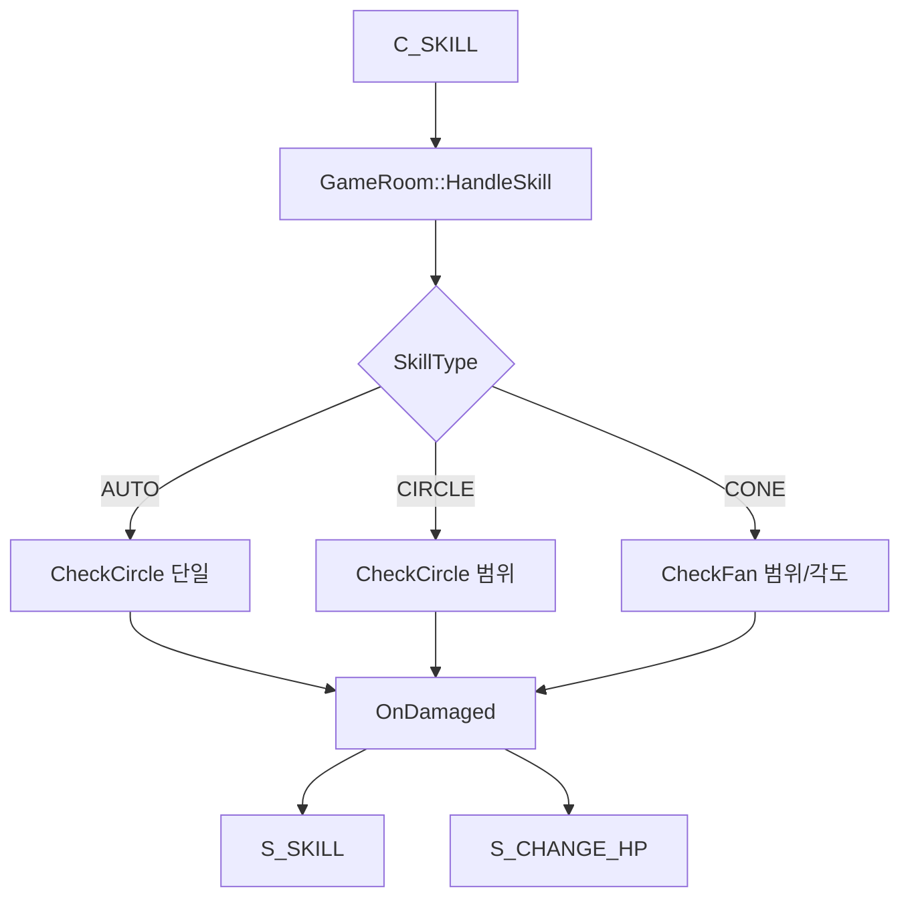
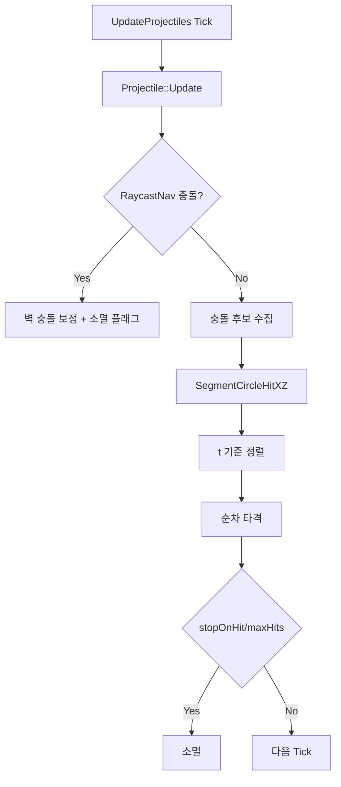
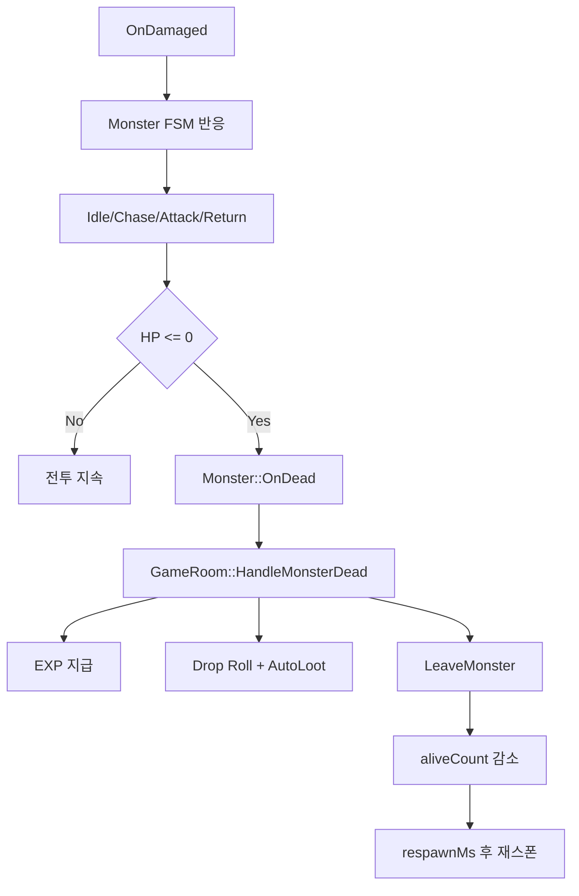
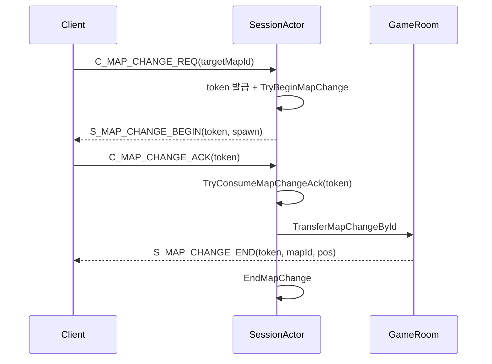
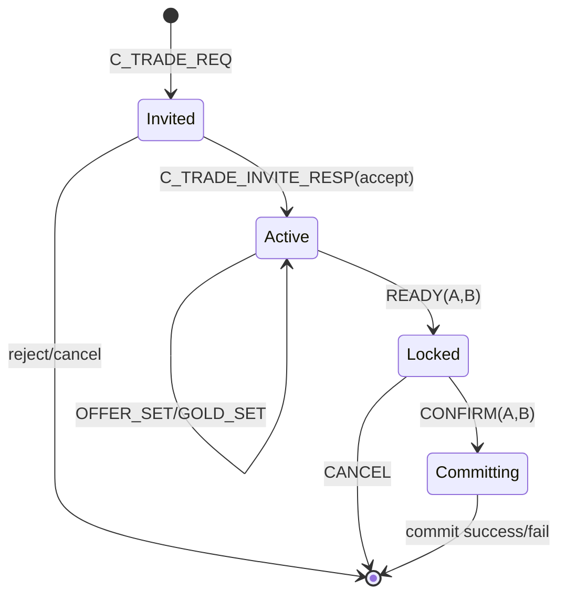

## Section 2: 핵심 차별화 기능 딥다이브 (Page 6~21)

> 편집 기준: 장문 설명 대신 카드/표/다이어그램 중심으로 구성한다.
> 제출 기준: 각 페이지는 그대로 복붙 가능한 문구 + 코드 스니펫 위치를 함께 제공한다.

---

## 2-1. 서버 권위 이동 검증 (Page 6~9)

### Page 6. 서버 권위 이동 검증: 필요한 이유

**레이아웃**
- 상단: 제목 + 한 줄 서브카피
- 본문 좌측: `클라이언트 신뢰 시 실제 문제` 카드 3개
- 본문 우측: `서버 권위 설계 원칙` + `검증 경계` 리스트
- 하단: `위협-대응 구조 다이어그램`

**상단 카피 (복붙용)**
- 제목: `2-1. 서버 권위 이동 검증: 필요한 이유`
- 서브카피: `클라이언트 입력은 제안, 위치 확정은 서버 책임`
- 핵심 메시지: `"이동은 클라이언트 입력일 뿐, 최종 위치는 서버가 검증 후 확정한다."`

**좌측 카드 카피 | 클라이언트 신뢰 시 실제 문제**
| 항목 | 문제 | 결과 |
| --- | --- | --- |
| 1 | 속도핵/텔레포트 | 짧은 시간 과도한 거리 이동 |
| 2 | 벽 통과/비정상 지형 진입 | 월드 규칙 붕괴 |
| 3 | 시퀀스 역전/재전송 패킷 | 과거 상태가 현재 상태를 덮어씀 |

- 요약 한 줄: `월드 상태 오염 -> 전투 공정성 저하 -> 클라이언트 간 Desync`

**우측 카드 카피 | 서버 권위 설계 원칙**
- 서버가 `seq`, `dt`, `speed`, `navmesh`를 순차 검증
- 비정상 요청은 `drop`, 경계 요청은 `clamp/slide`
- 검증 완료 좌표만 월드 상태에 `commit`
- 확정 결과만 AOI 대상에 `S_MOVE` 브로드캐스트

**검증 경계 (제출 포인트)**
- 입력 안정성: NaN/Inf/Crazy Position 즉시 거부
- 순서/시간: 역순 `seq` drop, `dt` 최소/최대 보정
- 속도: 허용 거리 초과 시 이동 거리 제한
- 지형: `ValidateMove` 통과 좌표만 반영

**하단 다이어그램 (복붙용)**


**코드 스니펫 배치**
- Snippet 6-A (입력 진입/직렬화): `GameServer/ClientPacketHandler.GamePlay.cpp:8`
- Snippet 6-B (검증 메인 파이프라인): `GameServer/GameRoom.Move.cpp:29`
- Snippet 6-C (검증 유틸): `GameServer/MoveValidationUtils.h:19`, `GameServer/MoveValidationUtils.h:28`, `GameServer/MoveValidationUtils.h:57`

**하단 캡션**
- `클라이언트는 제안하고, 서버가 검증 후 확정한다.`

---

### Page 7-8. 이동 검증 파이프라인

**레이아웃**
- 상단: 제목 + 코드 순서 기준 서브카피
- 본문 좌측: 검증 흐름 A(1~3)
- 본문 우측: 검증 흐름 B(4~6)
- 하단: 6단계 요약 + 분기 처리 박스

**상단 카피 (복붙용)**
- 제목: `2-1. 이동 검증 파이프라인`
- 서브카피: `코드 순서 기준: 입력 수신부터 상태 확정/전파까지`

**본문 카피 | 파이프라인 6단계**
1. `Handle_C_MOVE` 수신 후 RoomActor Queue enqueue
2. 입력 안정성 검사 (NaN/Inf/CrazyPos)
3. 순서/시간 검사 (`IsSeqNewer`, `ComputeDtSec`)
4. 속도 검사 (`CheckSpeed2D`, 초과 시 clamp)
5. 지형/충돌 검사 (`ValidateMove`, 필요 시 slide/correct)
6. 좌표 확정 (Commit + AOI + `S_MOVE` + MoveStamp)

**분기 처리 카피**
- 입력 오류/역순 seq: `drop`
- 과속 이동: `clamp -> 재검증`
- 지형 불일치: `slide/correct -> 확정`

**다이어그램 (복붙용)**


**코드 스니펫 배치**
- Snippet 7-A (1~4단계): `GameServer/GameRoom.Move.cpp:45`, `GameServer/GameRoom.Move.cpp:75`, `GameServer/GameRoom.Move.cpp:90`, `GameServer/GameRoom.Move.cpp:102`
- Snippet 7-B (5~6단계): `GameServer/GameRoom.Move.cpp:117`, `GameServer/GameRoom.Move.cpp:151`, `GameServer/GameRoom.Move.cpp:155`, `GameServer/GameRoom.Move.cpp:168`
- Snippet 7-C (슬라이딩/보정): `GameServer/NavSystem.cpp:182`

**하단 캡션**
- `비정상 입력은 drop, 경계 입력은 보정, 확정 좌표만 공유 상태에 반영한다.`

---

### Page 9. 이동 검증 결과 (로그/좌표 보정 사례)

**레이아웃**
- 상단: 테스트 목표 한 줄
- 본문 좌측: 실패 케이스 카드
- 본문 우측: 보정 케이스 카드
- 하단: `요청 좌표 vs 서버 확정 좌표` 비교 표

**상단 카피 (복붙용)**
- 제목: `2-1. 검증 결과: 서버가 실제로 막는가?`
- 서브카피: `로그 + 좌표 비교로 drop/clamp 동작을 증명`

**실패 케이스 카드**
- 케이스: `MOVE_SEQ_REWIND_DROP`
- 요청: 과거 `seq` 재전송
- 서버 처리: 즉시 drop
- 결과: 위치 미변경

**보정 케이스 카드**
- 케이스: `SPEED_EXCEEDED_CLAMP`
- 요청: 허용 이동거리 초과
- 서버 처리: clamp 후 NavMesh 재검증
- 결과: 보정 좌표로 commit

**비교 표 템플릿 (복붙용)**
| 시나리오 | reqDist2D | maxDist | 서버 처리 | 최종 좌표 |
| --- | --- | --- | --- | --- |
| 역순 seq | - | - | drop | 변경 없음 |
| 과속 이동 | (측정값) | (허용값) | clamp + validate | (보정 좌표) |

**코드 스니펫/로그 근거**
- 로그 포인트: `GameServer/GameRoom.Move.cpp:83`, `GameServer/GameRoom.Move.cpp:108`
- 결론 문구: `비정상 이동 요청은 서버에서 drop/clamp되어 월드 정합성이 유지된다.`

---

## 2-2. AOI 최적화 + 스냅샷 배칭 (Page 10~12)

### Page 10. 전송 대상 축소가 필요한 이유

**레이아웃**
- 상단: 문제 정의
- 본문 좌측: 브로드캐스트 한계
- 본문 우측: AOI 전략
- 하단: `Before vs After` 비교 박스

**상단 카피 (복붙용)**
- 제목: `2-2. AOI 최적화: 먼저 대상을 줄인다`
- 서브카피: `패킷 크기보다 먼저, 보내는 대상 수를 줄여야 한다`

**좌측 카드 | 브로드캐스트 방식의 한계**
- 엔티티 증가 시 `O(N x M)` 전송 루프 확대
- CPU: 직렬화/필터 루프 비용 증가
- 네트워크: 송신 버퍼 급증, 지연 확대

**우측 카드 | AOI 적용 전략**
- `SpatialGrid`로 후보군 1차 축소
- 거리 + Connectivity로 2차 필터링
- 최종 가시 집합만 전송

**하단 비교 카피**
| 구분 | 기존 | 개선 |
| --- | --- | --- |
| 대상 선정 | 전체 브로드캐스트 | AOI 후보군 한정 |
| 판정 기준 | 거리 위주 | 거리 + 연결성 |
| 결과 | 불필요 전송 다수 | 유효 대상 중심 전송 |

**코드 스니펫 배치**
- Snippet 9-A (후보군 수집): `GameServer/GameRoom.AOI.v2.cpp:25`
- Snippet 9-B (Zone 반경 조회): `GameServer/SpatialGrid.cpp:106`
- Snippet 9-C (AOI 갱신 스로틀): `GameServer/GameRoom.AOI.v2.cpp:46`

**하단 캡션**
- `AOI는 브로드캐스트 최적화가 아니라 전송 대상을 구조적으로 제한하는 설계다.`

---

### Page 11. SpatialGrid + Connectivity 필터

**레이아웃**
- 상단: 2단계 필터 개요
- 본문 좌측: Broad Phase
- 본문 우측: Narrow Phase
- 하단: 필터 파이프라인 다이어그램

**상단 카피 (복붙용)**
- 제목: `2-2. 후보 축소 + 연결성 검증`
- 서브카피: `가까워도 연결되지 않으면 보이지 않게 만든다`

**본문 카피**
- 1단계 Broad Phase: 인접 Zone 후보 수집
- 2단계 Narrow Phase: 거리 + Connectivity 통과 대상만 채택
- 효과: 벽 너머/층 분리 상황에서 시야 오판정 감소

**다이어그램 (복붙용)**


**코드 스니펫 배치**
- Snippet 10-A (후보군 + connectivity key): `GameServer/GameRoom.AOI.v2.cpp:185`, `GameServer/GameRoom.AOI.v2.cpp:191`, `GameServer/GameRoom.AOI.v2.cpp:197`
- Snippet 10-B (거리/연결성 필터): `GameServer/GameRoom.AOI.v2.cpp:219`, `GameServer/GameRoom.AOI.v2.cpp:223`, `GameServer/GameRoom.AOI.v2.cpp:240`
- Snippet 10-C (반경 조회 구현): `GameServer/SpatialGrid.cpp:106`

**하단 캡션**
- `Grid로 후보를 줄이고 Connectivity로 정제해 오판정과 불필요 전송을 동시에 줄인다.`

---

### Page 12. 스냅샷 배칭 전송 결과

**레이아웃**
- 상단: 입장 시 버스트 문제 정의
- 본문 좌측: 스냅샷 경계 처리
- 본문 우측: 배칭 전송 정책
- 하단: begin/end 시퀀스 타임라인

**상단 카피 (복붙용)**
- 제목: `2-2. Snapshot Batching: 입장 버스트 완화`
- 서브카피: `snapshot_id + begin/end로 경계를 명확히 보낸다`

**좌측 카드 | 스냅샷 경계 규칙**
- 첫 패킷: `snapshot_begin=true`
- 마지막 패킷: `snapshot_end=true`
- 빈 스냅샷도 begin/end를 전송해 로딩 정지 방지

**우측 카드 | 배칭 정책**
- 엔티티를 배치 단위로 분할 송신
- forceFullSnapshot 경로도 동일 규칙 적용
- 클라이언트는 완료 시점을 패킷으로 확정 가능

**하단 타임라인 (복붙용)**
1. `S_SPAWN(begin=true, end=false)`
2. `S_SPAWN(begin=false, end=false)` x N
3. `S_SPAWN(begin=false, end=true)`

**코드 스니펫 배치**
- Snippet 11-A (begin/end + 빈 스냅샷): `GameServer/GameRoom.AOI.v2.cpp:130`, `GameServer/GameRoom.AOI.v2.cpp:143`, `GameServer/GameRoom.AOI.v2.cpp:144`, `GameServer/GameRoom.AOI.v2.cpp:457`
- Snippet 11-B (forceFullSnapshot 배칭): `GameServer/GameRoom.AOI.v2.cpp:393`, `GameServer/GameRoom.AOI.v2.cpp:466`, `GameServer/GameRoom.AOI.v2.cpp:467`
- Snippet 11-C (입장 시 트리거): `GameServer/GameRoom.EnterLeave.cpp:89`, `GameServer/GameRoom.EnterLeave.cpp:126`

**하단 캡션**
- `입장 스냅샷을 경계 기반으로 분할 전송해 버스트와 로딩 불확실성을 동시에 줄인다.`

---

## 2-3. 전투/투사체 서버 판정 (Page 13~16)

### Page 13. 스킬 판정 구조 (즉발/범위/부채꼴)

**레이아웃**
- 상단: 판정 철학
- 본문 좌측: 스킬 타입별 판정 표
- 본문 우측: 처리 결과 전파
- 하단: ResolveSkill 분기 다이어그램

**상단 카피 (복붙용)**
- 제목: `2-3. 스킬 판정은 서버에서 확정`
- 서브카피: `클라이언트는 요청, 명중/피해는 서버가 결정`

**타입별 판정 표**
| 타입 | 판정 방식 | 특징 |
| --- | --- | --- |
| `SKILL_AUTO` | 단일 타겟 circle | 즉발 단일 판정 |
| `SKILL_AREA_CIRCLE` | 반경 기반 | 범위 내 다수 판정 |
| `SKILL_AREA_CONE` | 방향/각도 fan | 전방 부채꼴 판정 |

**전파 카피**
- 피해 확정 후 서버가 HP 갱신
- 결과 패킷: `S_SKILL`, `S_CHANGE_HP`
- 클라이언트는 결과를 수신/렌더링

**다이어그램 (복붙용)**


**코드 스니펫 배치**
- Snippet 12-A (타입 분기/판정): `GameServer/BattleSystem.cpp:20`, `GameServer/BattleSystem.cpp:86`, `GameServer/BattleSystem.cpp:97`, `GameServer/BattleSystem.cpp:107`
- Snippet 12-B (요청 진입/전파): `GameServer/GameRoom.Combat.cpp:10`, `GameServer/GameRoom.Combat.cpp:119`, `GameServer/GameRoom.Combat.cpp:127`, `GameServer/GameRoom.Combat.cpp:142`

**하단 캡션**
- `명중과 피해는 서버 단일 경로에서 확정된다.`

---

### Page 14. 투사체 시뮬레이션 (충돌/NavMesh 레이캐스트)

**레이아웃**
- 상단: Tick 기반 처리 원칙
- 본문 좌측: 벽 충돌 처리
- 본문 우측: 대상 충돌 처리
- 하단: 투사체 업데이트 파이프라인

**상단 카피 (복붙용)**
- 제목: `2-3. 투사체도 서버 Tick에서 판정`
- 서브카피: `벽 충돌 + 대상 충돌을 순서대로 계산`

**좌측 카드 | 벽 충돌 처리**
- `oldPos -> newPos` 구간 Raycast
- 충돌 시 충돌 지점으로 좌표 보정
- 관통 불가 조건이면 소멸 처리

**우측 카드 | 대상 충돌 처리**
- `SegmentCircleHitXZ`로 후보 충돌 계산
- 충돌 시점 `t` 기준 정렬 후 순차 타격
- `stopOnHit`, `maxHits`로 관통/다중 타격 제어

**다이어그램 (복붙용)**


**코드 스니펫 배치**
- Snippet 13-A (선분-원 충돌): `GameServer/GameRoom.Projectile.cpp:15`
- Snippet 13-B (Raycast 보정): `GameServer/GameRoom.Projectile.cpp:314`, `GameServer/GameRoom.Projectile.cpp:321`
- Snippet 13-C (정렬/타격): `GameServer/GameRoom.Projectile.cpp:383`, `GameServer/GameRoom.Projectile.cpp:444`, `GameServer/GameRoom.Projectile.cpp:475`

**하단 캡션**
- `투사체 판정을 서버 Tick으로 고정해 벽 관통과 중복 타격을 차단한다.`

---

### Page 15. 쿨타임 서버 검증 + 중복 타격 방지

**레이아웃**
- 상단: 왜 두 축이 필요한가
- 본문 좌측: 쿨타임 검증
- 본문 우측: 중복 타격 방지
- 하단: 실패/차단 케이스 요약

**상단 카피 (복붙용)**
- 제목: `2-3. 연사/중복 히트 방어`
- 서브카피: `쿨타임은 서버 시간, 타격 기록은 서버 집합`

**좌측 카드 | 쿨타임 검증**
- 사용 전 `CanUseSkill` 검사
- 사용 시 `StartSkillCooldown` 갱신
- 기준 시간은 서버 시간

**우측 카드 | 중복 타격 방지**
- 투사체별 `_hitVictims` 집합 관리
- `HasAlreadyHit`로 재타격 차단
- `MarkHit`로 타격 이력 기록

**하단 요약 박스**
- 반복 요청: 쿨타임 검증으로 차단
- 동일 대상 재충돌: hit set으로 차단
- 결과: 피해 산정 일관성 유지

**코드 스니펫 배치**
- Snippet 14-A (쿨타임): `GameServer/Creature.cpp:54`, `GameServer/Creature.cpp:77`, `GameServer/GameRoom.Combat.cpp:37`, `GameServer/GameRoom.Combat.cpp:49`, `GameServer/GameRoom.Combat.cpp:123`
- Snippet 14-B (타격 이력 구조): `GameServer/Projectile.h:53`, `GameServer/Projectile.h:59`
- Snippet 14-C (충돌 루프 적용): `GameServer/GameRoom.Projectile.cpp:403`, `GameServer/GameRoom.Projectile.cpp:426`, `GameServer/GameRoom.Projectile.cpp:475`

**하단 캡션**
- `반복 입력과 중복 히트를 서버 상태로 통제한다.`

---

### Page 16. 전투 판정 + 몬스터 AI + 드랍 처리 흐름

**레이아웃**
- 상단: 전투 이후까지 포함한 서버 흐름
- 본문 좌측: AI 상태 전이
- 본문 우측: 사망 후 처리
- 하단: end-to-end 다이어그램

**상단 카피 (복붙용)**
- 제목: `2-3. 피해 확정 이후도 서버가 마무리`
- 서브카피: `AI 반응 -> 보상 지급 -> 리스폰 스케줄까지 단일 흐름`

**좌측 카드 | AI 상태 전이**
- 상태: `Idle -> Chase -> Attack -> Return`
- 피격 이벤트가 상태 전이 트리거
- 전투 중 상태 전이가 서버 Tick에서 진행

**우측 카드 | 사망 후 처리**
- `HandleMonsterDead`에서 EXP/드랍 처리
- 몬스터 제거 + aliveCount 감소
- `respawnMs` 기준 재스폰 스케줄 등록

**다이어그램 (복붙용)**


**코드 스니펫 배치**
- Snippet 15-A (FSM): `GameServer/Monster.cpp:98`
- Snippet 15-B (사망 이벤트): `GameServer/Monster.cpp:500`, `GameServer/Monster.cpp:514`
- Snippet 15-C (보상/드랍): `GameServer/GameRoom.Items.cpp:699`, `GameServer/GameRoom.Items.cpp:721`, `GameServer/GameRoom.Items.cpp:746`, `GameServer/GameRoom.Items.cpp:765`
- Snippet 15-D (리스폰): `GameServer/GameRoom.LifeTime.cpp:153`, `GameServer/GameRoom.LifeTime.cpp:176`

**하단 캡션**
- `전투 판정부터 월드 정리까지 서버 권위 흐름으로 일관되게 연결된다.`

---

## 2-4. 파티/인스턴스/맵 전이 (Page 17~19)

### Page 17. 맵 변경 핸드셰이크

**레이아웃**
- 상단: 4단계 전이 규칙
- 본문 좌측: 요청/토큰/ACK 흐름
- 본문 우측: 실패 방어 포인트
- 하단: sequence diagram

**상단 카피 (복붙용)**
- 제목: `2-4. Map Change는 토큰 기반 핸드셰이크`
- 서브카피: `요청 -> 토큰 발급 -> ACK 검증 -> 완료`

**본문 카피**
- 시작: `TryBeginMapChange`에서 토큰/목적지 잠금
- 검증: ACK 토큰 일치 시에만 전이 수행
- 종료: `S_MAP_CHANGE_END` 전송 후 상태 해제

**실패 방어 포인트**
- 중복 요청 차단
- 위조/오래된 ACK 차단
- 전이 중 패킷 혼입 차단

**다이어그램 (복붙용)**


**코드 스니펫 배치**
- Snippet 16-A (요청/토큰/begin): `GameServer/ClientPacketHandler.MapChange.cpp:11`, `GameServer/ClientPacketHandler.MapChange.cpp:67`, `GameServer/ClientPacketHandler.MapChange.cpp:70`
- Snippet 16-B (ACK 소비/상태 전이): `GameServer/ClientPacketHandler.MapChange.cpp:89`, `GameServer/ClientPacketHandler.MapChange.cpp:106`, `GameServer/PlayerSession.cpp:119`, `GameServer/PlayerSession.cpp:152`
- Snippet 16-C (완료 패킷): `GameServer/GameRoom.EnterLeave.cpp:95`, `GameServer/GameRoom.EnterLeave.cpp:115`

**하단 캡션**
- `맵 전이는 토큰 검증을 통과한 요청만 완료된다.`

---

### Page 18. 파티 구조와 정합성 제어

**레이아웃**
- 상단: 정합성 전략
- 본문 좌측: 단일 액터 직렬화
- 본문 우측: 초대 TTL/재검증
- 하단: 상태 변경 체크리스트

**상단 카피 (복붙용)**
- 제목: `2-4. Party는 단일 JobQueue로 직렬화`
- 서브카피: `생성/초대/수락/탈퇴를 한 경로로 처리`

**좌측 카드 | 직렬화 포인트**
- `PartyActor` 단일 큐에서 상태 변경 처리
- 동시 요청 경합 감소
- 상태 전이 순서가 코드로 고정

**우측 카드 | 초대 정합성**
- 초대는 `targetId` 기준 pending 관리
- TTL 60초 적용
- 수락 시점에 만료/중복 가입/던전 상태 재검증

**하단 체크리스트 (복붙용)**
- 초대 만료 시 즉시 실패 처리
- 이미 파티 가입된 대상 수락 거부
- 던전 전이 상태에서 비정상 수락 차단

**코드 스니펫 배치**
- Snippet 17-A (액터 진입점): `GameServer/PartyActor.h:21`
- Snippet 17-B (초대 생성/TTL): `GameServer/PartyManagerCore.cpp:66`, `GameServer/PartyManagerCore.cpp:100`
- Snippet 17-C (수락 재검증): `GameServer/PartyManagerCore.cpp:108`, `GameServer/PartyManagerCore.cpp:119`, `GameServer/PartyManagerCore.cpp:139`

**하단 캡션**
- `파티 상태는 단일 큐 직렬화 + TTL 재검증으로 안정화된다.`

---

### Page 19. 인스턴스 던전 생명주기

**레이아웃**
- 상단: 생성/종료 기준
- 본문 좌측: 입장/플레이 상태
- 본문 우측: 종료/정리 상태
- 하단: 수명주기 다이어그램

**상단 카피 (복붙용)**
- 제목: `2-4. Instance Lifecycle: 생성부터 Purge까지`
- 서브카피: `파티 상태와 동기화된 인스턴스 수명주기`

**좌측 카드 | 생성/입장**
- 키: `RoomKey(channelId, mapId, instanceId)`
- 입장 시 `ENTERING -> IN_DUNGEON`
- 중복 생성 방지

**우측 카드 | 종료/정리**
- 퇴장 시 `EXITING -> NONE`
- `partyToInstance/playerToInstance` 매핑 정리
- `MarkClosing + PurgeInstanceRooms`로 룸 정리

**다이어그램 (복붙용)**
```mermaid
flowchart TD
  A[Party ENTERING] --> B[CreateOrGetForParty]
  B --> C[RoomKey(ch,map,instance) 생성]
  C --> D[멤버 이동/플레이]
  D --> E{탈퇴/강퇴/해산/타임아웃}
  E --> F[CloseForParty or CloseByInstanceId]
  F --> G[매핑 정리]
  G --> H[room.MarkClosing]
  H --> I[RoomManager PurgeInstanceRooms]
  I --> J[월드 복귀]
```

**코드 스니펫 배치**
- Snippet 18-A (생성/조회): `GameServer/InstanceManagerCore.cpp:41`
- Snippet 18-B (종료/정리): `GameServer/InstanceManagerCore.cpp:79`, `GameServer/InstanceManagerCore.cpp:182`
- Snippet 18-C (입/퇴장 상태 전이): `GameServer/ClientPacketHandler.Dungeon.cpp:134`, `GameServer/ClientPacketHandler.Dungeon.cpp:159`, `GameServer/ClientPacketHandler.Dungeon.cpp:360`, `GameServer/ClientPacketHandler.Dungeon.cpp:384`
- Snippet 18-D (빈 인스턴스 Purge): `GameServer/RoomManager.cpp:125`, `GameServer/RoomManager.cpp:164`

**하단 캡션**
- `인스턴스는 파티 상태와 묶여 생성/종료/정리까지 일관되게 처리된다.`

---

## 2-5. 거래 원자성 보장 (Page 20~22)

### Page 20. 거래 상태머신

**레이아웃**
- 상단: 상태 머신 개요
- 본문 좌측: 상태 전이 규칙
- 본문 우측: 단계별 검증 포인트
- 하단: state diagram

**상단 카피 (복붙용)**
- 제목: `2-5. Trade State Machine`
- 서브카피: `Invited -> Active -> Locked -> Committing`

**좌측 카드 | 상태 전이 규칙**
| 상태 | 허용 동작 | 금지 동작 |
| --- | --- | --- |
| Invited | 수락/거절 | 제안 수정 |
| Active | 아이템/골드 제안 | 확정 커밋 |
| Locked | confirm 대기 | 제안 변경 |
| Committing | 결과 수신 | 취소/수정 |

**우측 카드 | 검증 포인트**
- 대상/거리/중복 거래 확인
- 아이템 상태/골드 범위 확인
- 맵 전이/접속 종료 시 강제 취소

**다이어그램 (복붙용)**


**코드 스니펫 배치**
- Snippet 19-A (상태 정의): `GameServer/GameRoom.h:299`
- Snippet 19-B (요청 검증): `GameServer/GameRoom.Trade.cpp:136`, `GameServer/GameRoom.Trade.cpp:167`, `GameServer/GameRoom.Trade.cpp:174`
- Snippet 19-C (Locked/Committing 전이): `GameServer/GameRoom.Trade.cpp:405`, `GameServer/GameRoom.Trade.cpp:447`, `GameServer/GameRoom.Trade.cpp:457`, `GameServer/GameRoom.Trade.cpp:489`
- Snippet 19-D (전이/종료 강제 취소): `GameServer/GameRoom.MapChange.cpp:53`, `GameServer/GameRoom.EnterLeave.cpp:165`

**하단 캡션**
- `단계별 상태 전이와 금지 규칙으로 거래 중 조작을 차단한다.`

---

### Page 21. 2-Phase Commit

**레이아웃**
- 상단: 2단계 커밋 개요
- 본문 좌측: Phase 1 (GameServer)
- 본문 우측: Phase 2 (DBAgent)
- 하단: 성공/실패 분기 플로우

**상단 카피 (복붙용)**
- 제목: `2-5. Trade 2PC: 선검증 + DB 원자 커밋`
- 서브카피: `성공은 동시 반영, 실패는 전체 롤백`

**좌측 카드 | Phase 1 (GameServer)**
- 메모리 스냅샷으로 최종 결과 시뮬레이션
- `TradeCommitPlan` 생성
- 실패 시 DB 요청 없이 내부 취소

**우측 카드 | Phase 2 (DBAgent)**
- `BEGIN TRAN`
- 아이템 DELETE/UPSERT + 골드 UPDATE
- 성공 `COMMIT`, 실패 `ROLLBACK`

**다이어그램 (복붙용)**
```mermaid
flowchart TD
  A[Locked + Confirm(A,B)] --> B[Phase1 BuildTradeCommitPlan]
  B -->|Fail| X1[CancelTrade INTERNAL]
  B -->|Success| C[S2S_REQ_TRADE_COMMIT]
  C --> D[DBAgent BEGIN TRAN]
  D --> E[DELETE/UPSERT ITEMS + UPDATE GOLD]
  E -->|Success| F[COMMIT]
  E -->|Fail| G[ROLLBACK]
  F --> H[S2S_RES success]
  G --> I[S2S_RES fail]
  H --> J[메모리/Redis/클라 반영]
  I --> K[CancelTrade INTERNAL]
```

**코드 스니펫 배치**
- Snippet 20-A (Phase 1 계획): `GameServer/GameRoom.Trade.cpp:624`
- Snippet 20-B (S2S 요청): `GameServer/GameRoom.Trade.cpp:944`, `GameServer/GameRoom.Trade.cpp:972`, `Common/Protobuf/bin/Protocol_S2S.proto:175`
- Snippet 20-C (DB 트랜잭션): `DBAgent/DBAgentPacketHandler.cpp:821`, `DBAgent/DBAgentPacketHandler.cpp:856`, `DBAgent/DBAgentPacketHandler.cpp:1025`
- Snippet 20-D (응답 반영): `GameServer/S2SPacketHandler.cpp:134`, `GameServer/GameRoom.Trade.cpp:1023`, `GameServer/GameRoom.Trade.cpp:1065`

**하단 캡션**
- `Phase 1 실패는 사전 중단, Phase 2 실패는 DB 롤백으로 처리한다.`

---

### Page 22. 거래 검증 결과

**레이아웃**
- 상단: 검증 목표
- 본문: 테스트 케이스 표(실패/경계/동시성)
- 하단: 증빙 체크리스트 + 결론 한 줄

**상단 카피 (복붙용)**
- 제목: `2-5. 거래 검증: 실패는 무효, 성공은 동시 확정`
- 서브카피: `원자성과 정합성을 시나리오 기반으로 확인`

**테스트 케이스 표 (복붙용)**
| 케이스 | 기대 결과 | 근거 코드 |
| --- | --- | --- |
| 인벤 부족 | Phase 1에서 실패, DB 요청 없음 | `GameServer/GameRoom.Trade.cpp:883`, `GameServer/GameRoom.Trade.cpp:918` |
| 골드 음수/초과/오버플로우 | 사전 차단, 커밋 불가 | `GameServer/GameRoom.Trade.cpp:651`, `GameServer/GameRoom.Trade.cpp:658`, `GameServer/GameRoom.Trade.cpp:667` |
| DB 실패 | `ROLLBACK` 후 내부 취소 | `DBAgent/DBAgentPacketHandler.cpp:1026`, `GameServer/GameRoom.Trade.cpp:1045` |
| 동시 요청/경합 | 상태머신 위반 없음 | `GameServer/ClientPacketHandler.Trade.cpp:25`, `GameServer/GameRoom.Trade.cpp:470` |

**증빙 체크리스트**
- 성공: `S_TRADE_RESULT(success=true)` + 양측 골드/아이템 delta
- 실패: `S_TRADE_RESULT(success=false)` + `S_TRADE_CANCELLED`
- DB: COMMIT/ROLLBACK 분기 로그

**최종 결론 카피**
- `검증 실패 시 전체 롤백, 성공 시 동시 반영이 유지되어 거래 정합성이 보장된다.`

---

## Section 2 작성 가이드 (디자인 공통)

- 각 페이지는 `문제 -> 처리 원칙 -> 흐름도 -> 코드 근거` 순서로 고정
- 문단은 3줄 이내, 설명은 카드/표로 분해
- 하단 캡션은 반드시 한 줄 결론으로 통일
- 코드 스니펫은 페이지당 2~4개만 선택해 가독성 유지
