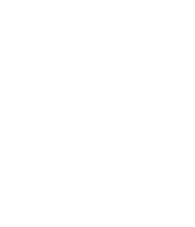

# 🧠 서버프로그래머 취업을 위한 CS 정리

> 게임 서버 프로그래머로 취업하기 위해, 컴퓨터공학의 핵심 이론들을 정리한 기술 학습 저장소입니다.  
> 특히 네오플, 크래프톤 등 **MMORPG 서버 개발**을 목표로 하며, 이론 학습과 포트폴리오 제작을 병행하고 있습니다.

---

## 📚 목차 (정리 중)

| 분야 | 설명 | 디렉토리 |
|------|----------|------|
| 🧠 운영체제 | 프로세스, 스레드, 메모리, 스케줄링, 동기화 등 |[운영체제](./Operating-System/README.md) |
| 🌐 네트워크 |  TCP/IP, 소켓, HTTP, WebSocket, 패킷 처리 등 |[네트워크](./Network/README.md) |
| ⚙️ C++ |  포인터, 스마트포인터, 멀티스레딩, STL 등 |[C++ 정리](./C++/README.md) |
| 🧪 면접 질문 정리 |  실제 예상 면접 질문 & 답변 모음 |[면접 질문 정리](./Interview/) |

---

## ✅ 목적

이 저장소는 서버 프로그래머로서의 기본기를 다지기 위한 **기술 면접 대비 학습 기록 저장소**입니다.

- 네트워크 이론부터 운영체제, C++까지 **실제 면접에 출제되는 내용**을 중심으로 정리했습니다.
- 단순 요약이 아니라, **개념 → 면접 질문 → 예시 코드** 순으로 정리해 **현업 적용**에 초점을 맞췄습니다.
- 모든 정리는 VSCode + GitHub 기반으로 관리하며, 꾸준한 커밋과 마크다운 문서화로 **기록 기반 성장**을 추구합니다.

---

## 🧤 사용 방식

1. VSCode 기반 마크다운 문서로 각 주제를 정리
2. 커밋 메시지는 `분야 + 요약` 스타일로 작성  
   예시: `OS: 프로세스 vs 스레드 정리`
3. 각 문서는 다음의 구성 순서로 작성됨:
   - 개념 요약
   - 관련 면접 질문 & 예시 답변
   - 예제 코드 or 시나리오
   - 주의사항 및 트러블슈팅

---

## 📌 목표

- 🎯 **2025년 하반기 네오플 서버개발자 채용 지원**
- 🔧 IOCP 기반 미니 MMORPG 서버 클론 프로젝트 제작
- 📘 2025.07까지 운영체제/네트워크/C++ 이론 1회독 완성
- 🧠 백준 실버~골드 수준 알고리즘 200문제 풀이

---

## 🧱 레포지토리 구조

---

## ✍️ 작성자

- **곽경인 (Kwak KyungIn)**  
  목표: **MMORPG 서버 프로그래머**  
  관심 분야: **네트워크 최적화**, **멀티스레딩**, **IOCP 기반 아키텍처**  
  GitHub: [@KwakKyungIn](https://github.com/KwakKyungIn)

---

> 🔥 단기간 암기보다, 꾸준한 정리와 코드 기반 이해를 목표로 학습하고 있습니다.  
> 💬 궁금한 점, 조언, 피드백은 언제든지 GitHub Issue나 Discussions로 환영합니다!
